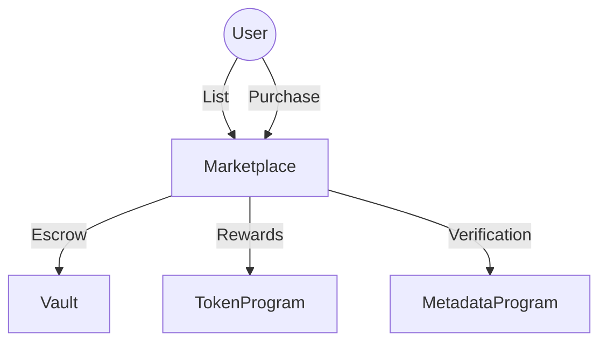
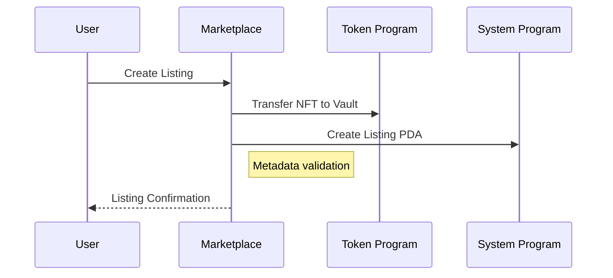
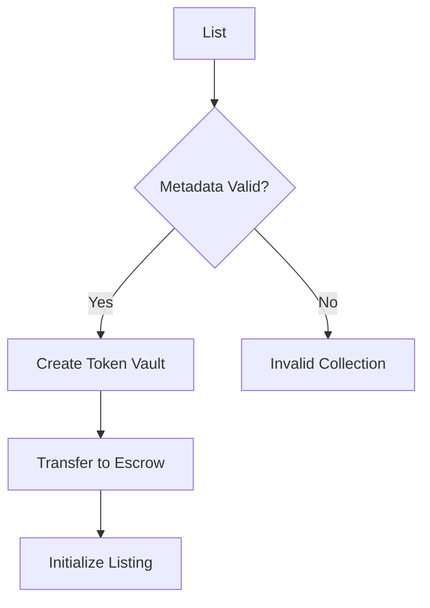
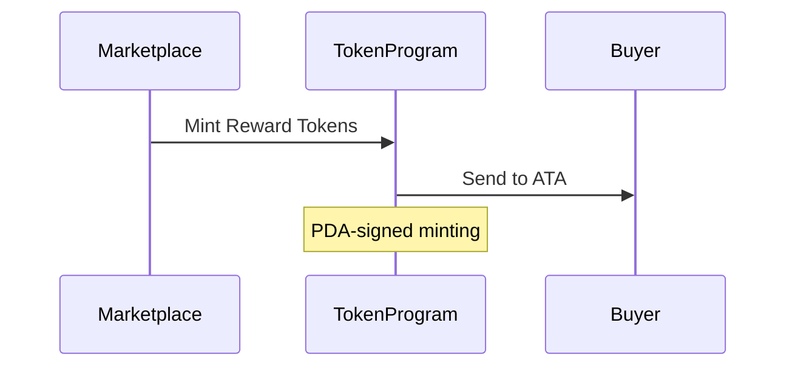
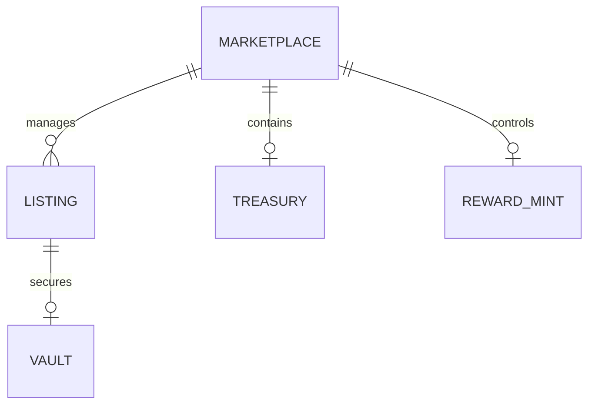

# Solana NFT Marketplace - Technical Documentation

## Table of Contents
1. [Protocol Overview](#protocol-overview)
2. [Key Features](#key-features)
3. [Core Components](#core-components)
4. [Transaction Flows](#transaction-flows)
5. [State Management](#state-management)
6. [Security Architecture](#security-architecture)
7. [Fee Structure](#fee-structure)
8. [Deployment Guide](#deployment-guide)
9. [Testing Strategy](#testing-strategy)
10. [License](#license)

## Protocol Overview <a name="protocol-overview"></a>
A decentralized NFT marketplace built on Solana with advanced features:
- **NFT Escrow System** - Secure token vault management
- **Dual Token Economy** - SOL payments with ERC20 rewards
- **Collection Verification** - Metaplex metadata validation
- **DAO Governance** - Configurable fee structure
- **Atomic Swaps** - Secure NFT-SOL transactions



## Key Features <a name="key-features"></a>
- 🛡️ NFT Metadata Validation
- 💸 Dual Currency System (SOL + ERC20)
- 🔒 PDA-Controlled Vaults
- 📈 Dynamic Fee Management
- 🎁 Reward Distribution Mechanism
- 🔄 Atomic Trade Execution
- 📦 Batch Listing Support

## Core Components <a name="core-components"></a>

### 1. State Accounts

#### Marketplace (Protocol Configuration)
```rust
#[account]
pub struct Marketplace {
    pub admin: Pubkey,         // Governance authority
    pub fee: u16,              // Transaction fee basis points
    pub treasury_bump: u8,     // Treasury PDA verification
    pub rewards_bump: u8,      // Reward mint PDA
    pub bump: u8,              // Marketplace PDA
    pub name: String           // Marketplace identifier
}
```

#### Listing (NFT Offer)
```rust
#[account]
pub struct Listing {
    pub maker: Pubkey,         // Seller wallet
    pub maker_mint: Pubkey,    // NFT mint address
    pub bump: u8,              // Listing PDA
    pub price: u64             // SOL price
}
```

### 2. Program Interactions


## Transaction Flows <a name="transaction-flows"></a>

### 1. Listing Creation


### 2. Purchase Execution
```rust
// Fee calculation logic
let fee = self.marketplace.fee as u64;
let amount = self.listing.price.checked_sub(fee).unwrap();

// SOL transfer breakdown
transfer(cpi_ctx, amount)?;  // To seller
transfer(cpi_ctx, fee)?;     // To treasury
```

### 3. Reward Distribution


## State Management <a name="state-management"></a>

### Account Relationships


### Storage Costs
| Account Type | Space Allocation | Purpose |
|--------------|-------------------|---------|
| Marketplace  | 80 bytes          | Protocol config |
| Listing      | 73 bytes          | NFT offer details |
| Vault        | 165 bytes         | NFT escrow |

## Security Architecture <a name="security-architecture"></a>

### 1. Critical Constraints
```rust
// Metadata validation
constraint = metadata.collection.as_ref().unwrap().key == collection_mint.key()
constraint = metadata.collection.as_ref().unwrap().verified == true

// PDA authorization
seeds = [
    b"marketplace",
    marketplace.name.as_str().as_bytes(),
    &[marketplace.bump]
```

### 2. Protection Mechanisms
- Reentrancy guards
- Integer overflow checks
- Atomic transaction rollback
- Signature verification
- Account ownership validation

## Fee Structure <a name="fee-structure"></a>

### Transaction Cost Breakdown
| Component | Fee Type | Description |
|-----------|----------|-------------|
| Platform  | 2%       | Treasury fee |
| Rewards   | 1%       | ERC20 minting |
| Network   | Variable | Solana gas |

```rust
// Fee calculation example
let total_price: u64 = 1_000_000_000; // 1 SOL
let platform_fee = total_price * 2 / 100; // 0.02 SOL
let reward_fee = total_price * 1 / 100;  // 0.01 SOL
```

## Deployment Guide <a name="deployment-guide"></a>

### 1. Environment Setup
```bash
# Install dependencies
solana-install init 1.14.16
cargo install --git https://github.com/coral-xyz/anchor avm
avm install latest && avm use latest

# Build and deploy
anchor build
anchor deploy --provider.cluster mainnet-beta
```

### 2. Initialization Command
```rust
// Initialize marketplace
initialize(
    name: "SolanaArt".to_string(),
    fee: 300  // 3% platform fee
)?;
```

## Testing Strategy <a name="testing-strategy"></a>

### Test Coverage Matrix
| Test Case | Verification Points |
|-----------|---------------------|
| Listing   | Metadata validation, vault creation |
| Purchase  | Fee calculation, NFT transfer |
| Delisting | Vault closure, NFT return |
| Rewards   | ERC20 minting accuracy |

### Sample Test Scenario
```javascript
it('should prevent invalid collection listings', async () => {
  await program.rpc.list(invalidCollectionMint, {
    accounts: {
      metadata: invalidMetadata,
    }
  });
  await assert.rejects(/*...*/);
});
```

## License <a name="license"></a>

```text
MIT License

Copyright (c) 2024 Solana Marketplace Developers

Permission is hereby granted... [Standard MIT terms]
```

**Full License:** [LICENSE.md](LICENSE.md)

---
